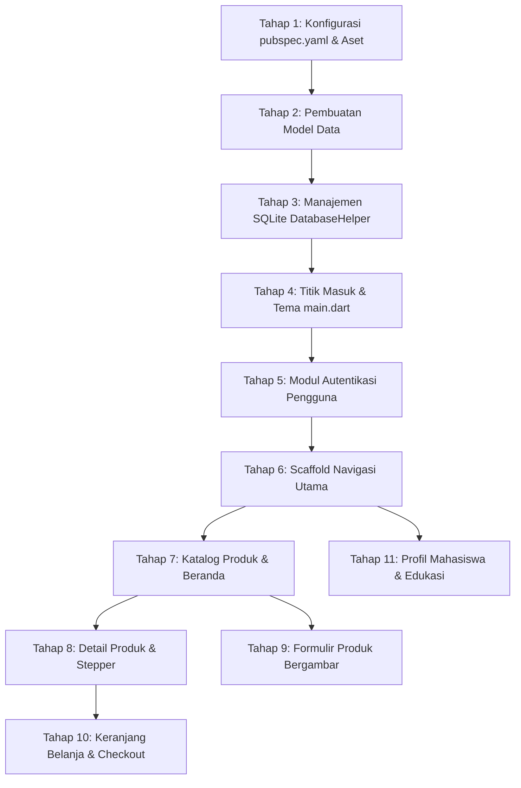

# Panduan Praktikum & Dokumentasi Arsitektur Proyek: Shooping App

Dokumentasi ini disusun sebagai pedoman pembelajaran terstruktur mata kuliah **Pemrograman Mobile**

---

## 1. Struktur Direktori Proyek

```text
shooping/
├── assets/
│   └── images/                     # Direktori aset gambar produk bawaan (laptop, kemeja, sepatu, tumbler)
├── lib/
│   ├── helpers/
│   │   └── db_helper.dart          # Kelas pembantu SQLite tunggal (CRUD & migrasi)
│   ├── models/
│   │   ├── cart_item.dart          # Model entitas item keranjang belanja
│   │   ├── product.dart            # Model entitas produk katalog
│   │   └── user.dart               # Model entitas pengguna dan autentikasi
│   ├── pages/
│   │   ├── cart_page.dart          # Halaman manajemen keranjang & simulasi checkout
│   │   ├── login_page.dart         # Halaman autentikasi masuk akun
│   │   ├── main_nav_page.dart      # Wadah navigasi bawah (BottomNavigationBar & IndexedStack)
│   │   ├── product_detail_page.dart# Halaman rincian spesifikasi & kuantitas produk
│   │   ├── product_form_page.dart  # Halaman formulir penambahan & pembaruan produk bergambar
│   │   ├── product_list_page.dart  # Halaman beranda katalog belanja & pencarian
│   │   ├── profile_page.dart       # Halaman profil mahasiswa, statistik, & log keluar
│   │   └── register_page.dart      # Halaman pendaftaran akun baru
│   └── main.dart                   # Titik masuk utama aplikasi & konfigurasi tema Material 3
├── pubspec.yaml                    # Konfigurasi dependensi & registrasi aset lokal
└── README.md                       # Buku panduan praktikum terstruktur mahasiswa
```

---

## 2. Peta Jalan Pembelajaran Mahasiswa (*Step-by-Step Learning Path*)

Mahasiswa diwajibkan mengikuti dan menelaah kode program dengan urutan pembelajaran berikut:



---

## 4. Penjelasan Komprehensif Berkas Kode Program

### 4.1 Konfigurasi Dependensi: `pubspec.yaml`
- **Deskripsi Berkas**: Berkas manifes utama aplikasi Flutter yang mendefinisikan versi SDK, pustaka pihak ketiga, dan deklarasi aset gambar statis.
- **Aktor Terkait**: Pengembang sistem.
- **Alur Kerja**:
  1. Mendaftarkan dependensi `sqflite` (penggerak SQLite) dan `path` (manajemen lokasi direktori basis data).
  2. Mendaftarkan pustaka `image_picker` untuk akses kamera dan galeri foto.
  3. Mendaftarkan folder `assets/images/` agar gambar contoh dikenali saat aplikasi dikompilasi.
- **Kebutuhan Fungsional**:
  | ID Kebutuhan | Deskripsi Kebutuhan | Prioritas |
  |---|---|---|
  | **REQ-DEP-01** | Sistem wajib menyediakan dependensi SQLite lokal (`sqflite`). | **WAJIB** |
  | **REQ-DEP-02** | Sistem wajib menyediakan izin pustaka penangkap gambar (`image_picker`). | **WAJIB** |
  | **REQ-DEP-03** | Seluruh aset visual produk bawaan wajib didaftarkan di bawah blok `assets:`. | **WAJIB** |

---

### 4.2 Model Data Pengguna: `lib/models/user.dart`
- **Deskripsi Berkas**: Representasi objek data pengguna (*User Entity*) yang mencakup atribut identitas akun untuk keperluan autentikasi.
- **Aktor Terkait**: Mahasiswa / Pengguna terdaftar.
- **Fungsi & Logika Kunci**:
  - `toMap()`: Mengonversi objek Dart menjadi `Map<String, dynamic>` untuk disimpan ke tabel `users`.
  - `User.fromMap()`: Mengonversi baris tabel SQLite menjadi objek instans `User`.
- **Kebutuhan Fungsional**:
  | ID Kebutuhan | Deskripsi Kebutuhan | Prioritas |
  |---|---|---|
  | **REQ-MOD-USER-01** | Wajib menyimpan data `id`, `name`, `email`, dan `password`. | **WAJIB** |
  | **REQ-MOD-USER-02** | Wajib menyediakan serialisasi dua arah (*Map Serialization*). | **WAJIB** |

---

### 4.3 Model Data Produk: `lib/models/product.dart`
- **Deskripsi Berkas**: Representasi objek komoditas barang (*Product Entity*) yang dijual pada aplikasi.
- **Aktor Terkait**: Administrator / Pengguna aplikasi.
- **Fungsi & Logika Kunci**:
  - `formattedPrice`: Getter untuk mengubah angka harga menjadi format Rupiah standar (`Rp 8.500.000`) murni dengan kalkulasi string tanpa dependensi luar.
  - `assetImage`: Pemetaan otomatis gambar kategori default bila produk tidak memiliki gambar kustom.
  - `buildImage()`: Widget cerdas yang otomatis memeriksa apakah gambar berasal dari aset bawaan (`assets/...`) atau berkas fisik lokal perangkat (`File(path)`), lengkap dengan *fallback icon* jika berkas tidak ditemukan.
- **Kebutuhan Fungsional**:
  | ID Kebutuhan | Deskripsi Kebutuhan | Prioritas |
  |---|---|---|
  | **REQ-MOD-PROD-01** | Wajib mencakup atribut `id`, `name`, `category`, `price`, `stock`, `description`, dan `image`. | **WAJIB** |
  | **REQ-MOD-PROD-02** | Wajib menyediakan metode pembangun visual gambar adaptif (`buildImage()`). | **WAJIB** |
  | **REQ-MOD-PROD-03** | Format harga mata uang Rupiah seharusnya diformat otomatis secara rapi. | **SEHARUSNYA** |

---

### 4.4 Model Data Keranjang: `lib/models/cart_item.dart`
- **Deskripsi Berkas**: Representasi entitas barang yang dipilih pengguna dan dimasukkan ke dalam keranjang belanja (*Shopping Cart Entity*).
- **Aktor Terkait**: Pembeli (*Shopper*).
- **Fungsi & Logika Kunci**:
  - `totalPrice`: Menghitung subtotal otomatis dari `price * quantity`.
  - `buildImage()`: Menampilkan visual thumbnail item di baris keranjang belanja.
  - `formatCurrency()`: Helper konversi angka rupiah lokal.
- **Kebutuhan Fungsional**:
  | ID Kebutuhan | Deskripsi Kebutuhan | Prioritas |
  |---|---|---|
  | **REQ-MOD-CART-01** | Wajib merekam tautan `product_id`, `name`, `category`, `price`, `quantity`, dan `image`. | **WAJIB** |
  | **REQ-MOD-CART-02** | Subtotal harga item wajib dihitung secara otomatis. | **WAJIB** |

---

### 4.5 Pengelola Basis Data: `lib/helpers/db_helper.dart`
- **Deskripsi Berkas**: Kelas *Singleton* terpusat yang bertanggung jawab atas seluruh siklus hidup basis data SQLite lokal (`shopping.db`).
- **Aktor Terkait**: Sistem aplikasi internal.
- **Alur Kerja**:
  1. `_initDatabase()`: Membuka berkas SQLite di memori lokal perangkat pada versi skema `3`.
  2. `_onCreate()`: Membuat tabel `users`, `products`, dan `cart_items` saat aplikasi pertama kali dipasang, lalu menjalankan *seeding* (penyemaian) data akun demo dan 4 produk awal.
  3. `_onUpgrade()`: Menangani migrasi skema basis data dengan klausa `ALTER TABLE` agar data mahasiswa tidak korup atau terhapus saat pembaruan versi.
  4. Menyediakan metode CRUD:
     - Autentikasi: `registerUser()`, `loginUser()`, `isEmailRegistered()`.
     - Produk: `getAllProducts()`, `getProductById()`, `insertProduct()`, `updateProduct()`, `deleteProduct()`.
     - Keranjang: `addToCart()`, `getCartItems()`, `updateCartQuantity()`, `removeFromCart()`, `clearCart()`.
- **Kebutuhan Fungsional**:
  | ID Kebutuhan | Deskripsi Kebutuhan | Prioritas |
  |---|---|---|
  | **REQ-DB-01** | Menggunakan pola desain *Singleton* untuk menjamin hanya 1 koneksi basis data yang aktif. | **WAJIB** |
  | **REQ-DB-02** | Menyediakan fungsi CRUD lengkap untuk produk, keranjang, dan pengguna. | **WAJIB** |
  | **REQ-DB-03** | Menyediakan data benih (*seed data*) otomatis untuk keperluan pengujian praktikum mahasiswa. | **SEHARUSNYA** |
  | **REQ-DB-04** | Menyediakan mekanisme *onUpgrade* yang aman dari kegagalan integritas data. | **WAJIB** |

---

### 4.6 Titik Masuk Utama: `lib/main.dart`
- **Deskripsi Berkas**: Berkas *entry-point* aplikasi Flutter yang menginisialisasi pustaka dan mendefinisikan tema visual Material 3 bernuansa Emerald Modern.
- **Aktor Terkait**: Seluruh pengguna.
- **Alur Kerja**:
  1. Memanggil `WidgetsFlutterBinding.ensureInitialized()` sebelum memuat antarmuka.
  2. Mengonfigurasi `ThemeData` berbasis `ColorScheme.fromSeed(seedColor: Color(0xFF0F766E))`.
  3. Menetapkan `LoginPage` sebagai layar pembuka (*initial route*).
- **Kebutuhan Fungsional**:
  | ID Kebutuhan | Deskripsi Kebutuhan | Prioritas |
  |---|---|---|
  | **REQ-MAIN-01** | Mengaktifkan standar desain visual Material 3 (`useMaterial3: true`). | **WAJIB** |
  | **REQ-MAIN-02** | Mengonfigurasi palet warna primer teal/emerald yang konsisten di seluruh widget. | **SEHARUSNYA** |

---

### 4.7 Halaman Masuk Akun: `lib/pages/login_page.dart`
- **Deskripsi Berkas**: Antarmuka autentikasi masuk akun pengguna dengan validasi formulir dan fitur akses cepat pengujian.
- **Aktor Terkait**: Pengguna umum / Mahasiswa.
- **Alur Kerja**:
  1. Pengguna memasukkan alamat email dan kata sandi.
  2. Pengguna dapat menekan tombol pintasan **"Gunakan Akun Demo"** untuk mengisi formulir secara instan (`mahasiswa@kampus.ac.id` / `password123`).
  3. Sistem memvalidasi kredensial ke SQLite melalui `DatabaseHelper.loginUser()`.
  4. Jika valid, navigasi dialihkan ke `MainNavPage` dengan membawa objek instans `User`.
- **Kebutuhan Fungsional**:
  | ID Kebutuhan | Deskripsi Kebutuhan | Prioritas |
  |---|---|---|
  | **REQ-AUTH-01** | Memvalidasi format email dan batas minimal panjang password. | **WAJIB** |
  | **REQ-AUTH-02** | Menyediakan tombol pintasan akun demo untuk mempermudah praktikum evaluasi. | **SEHARUSNYA** |
  | **REQ-AUTH-03** | Mengalihkan pengguna ke layar registrasi jika belum memiliki akun. | **WAJIB** |

---

### 4.8 Halaman Pendaftaran: `lib/pages/register_page.dart`
- **Deskripsi Berkas**: Antarmuka pendaftaran akun baru bagi mahasiswa ke dalam basis data lokal.
- **Aktor Terkait**: Calon pengguna baru.
- **Alur Kerja**:
  1. Pengguna menginput Nama Lengkap, Email Kampus, Kata Sandi, dan Konfirmasi Kata Sandi.
  2. Sistem memeriksa ketersediaan email via `DatabaseHelper.isEmailRegistered()`.
  3. Jika unik dan konfirmasi kata sandi cocok, data disimpan ke tabel `users` dan kembali ke halaman login.
- **Kebutuhan Fungsional**:
  | ID Kebutuhan | Deskripsi Kebutuhan | Prioritas |
  |---|---|---|
  | **REQ-REG-01** | Wajib memverifikasi kesesuaian antara kata sandi dan konfirmasi kata sandi. | **WAJIB** |
  | **REQ-REG-02** | Wajib menolak pendaftaran jika email telah terdaftar sebelumnya (*Unique Email Constraint*). | **WAJIB** |

---

### 4.9 Scaffold Navigasi Induk: `lib/pages/main_nav_page.dart`
- **Deskripsi Berkas**: Rangka pembungkus utama (*Main Scaffold*) yang mengatur bilah navigasi bawah (*Bottom Navigation Bar*).
- **Aktor Terkait**: Pengguna yang telah masuk akun (*Authenticated User*).
- **Alur Kerja**:
  1. Menggunakan widget `IndexedStack` untuk menampung 3 tab utama:
     - Indeks 0: Katalog Produk (`ProductListPage`)
     - Indeks 1: Keranjang Belanja (`CartPage`)
     - Indeks 2: Profil Mahasiswa (`ProfilePage`)
  2. `IndexedStack` memastikan status *scroll* dan input formulir pada tiap tab tidak ter-reset saat pengguna berpindah tab.
  3. Pergantian tab ditangani murni dengan pemanggilan `setState(() => _currentIndex = index)`.
- **Kebutuhan Fungsional**:
  | ID Kebutuhan | Deskripsi Kebutuhan | Prioritas |
  |---|---|---|
  | **REQ-NAV-01** | Wajib mempertahankan status layar antar-tab (*State Preservation*) via `IndexedStack`. | **WAJIB** |
  | **REQ-NAV-02** | Wajib menyediakan indikator visual tab yang sedang aktif dengan ikon dan label yang jelas. | **SEHARUSNYA** |

---

### 4.10 Halaman Katalog Produk: `lib/pages/product_list_page.dart`
- **Deskripsi Berkas**: Beranda utama aplikasi yang menyajikan katalog komoditas produk dalam tata letak kisi (*GridView*) 2 kolom modern.
- **Aktor Terkait**: Pembeli / Mahasiswa.
- **Alur Kerja**:
  1. Memuat daftar produk secara asinkron dari SQLite melalui `DatabaseHelper.getAllProducts()`.
  2. Menyediakan bilah pencarian *real-time* untuk memfilter produk berdasarkan nama produk.
  3. Menyediakan tombol filter kategori horizontal (Semua, Elektronik, Pakaian, Olahraga, Aksesoris).
  4. Setiap kartu produk menampilkan visual gambar, label stok, nama, harga, dan tombol cepat **+ Keranjang**.
  5. Tombol aksi mengambang (*FAB*) untuk membuka formulir penambahan produk baru.
- **Kebutuhan Fungsional**:
  | ID Kebutuhan | Deskripsi Kebutuhan | Prioritas |
  |---|---|---|
  | **REQ-CAT-01** | Menampilkan daftar produk dalam susunan kisi responsif 2 kolom. | **WAJIB** |
  | **REQ-CAT-02** | Mendukung pencarian teks dan penyaringan kategori secara seketika (*live filter*). | **WAJIB** |
  | **REQ-CAT-03** | Menyediakan tombol pintasan untuk langsung memasukkan barang ke keranjang belanja. | **SEHARUSNYA** |
  | **REQ-CAT-04** | Memungkinkan penyegaran data (*pull-to-refresh* / refresh button). | **SEHARUSNYA** |

---

### 4.11 Halaman Rincian Produk: `lib/pages/product_detail_page.dart`
- **Deskripsi Berkas**: Layar peninjauan informasi rinci suatu produk secara menyeluruh beserta pengaturan kuantitas pesanan.
- **Aktor Terkait**: Calon pembeli.
- **Alur Kerja**:
  1. Menampilkan foto produk dalam kontainer visual besar dengan sudut melengkung halus.
  2. Menyajikan deskripsi spesifikasi produk dan status ketersediaan stok.
  3. Menyediakan kontrol kuantitas (*stepper* `-` dan `+`) yang dibatasi sesuai batas stok yang tersedia.
  4. Menghitung subtotal secara langsung menggunakan `setState`.
  5. Menyediakan menu opsi pada AppBar untuk mengubah (*Edit*) atau menghapus (*Delete*) produk dari basis data dengan dialog konfirmasi aman.
- **Kebutuhan Fungsional**:
  | ID Kebutuhan | Deskripsi Kebutuhan | Prioritas |
  |---|---|---|
  | **REQ-DET-01** | Wajib memvalidasi kuantitas pembelian agar tidak melebihi stok yang tersedia. | **WAJIB** |
  | **REQ-DET-02** | Wajib memperbarui kalkulasi subtotal secara dinamis saat tombol kuantitas ditekan. | **WAJIB** |
  | **REQ-DET-03** | Menyediakan opsi pembaruan data dan penghapusan produk secara aman. | **SEHARUSNYA** |

---

### 4.12 Halaman Formulir Produk: `lib/pages/product_form_page.dart`
- **Deskripsi Berkas**: Antarmuka pembuatan produk baru atau penyuntingan data produk lama dengan fitur pemilihan gambar komprehensif.
- **Aktor Terkait**: Pengelola katalog / Mahasiswa praktikan.
- **Alur Kerja**:
  1. Menyediakan kartu visual **Foto Produk** di bagian paling atas:
     - Jika kosong: Menampilkan ikon kamera dan tombol pemilih.
     - Jika terisi: Menampilkan pratinjau foto, tombol ganti foto, dan tombol hapus foto.
  2. Mengetuk kartu foto akan membuka modal lembar bawah (*Modal Bottom Sheet*) dengan 3 opsi:
     - **Kamera**: Mengambil foto baru via pustaka `image_picker`.
     - **Galeri**: Memilih gambar dari media penyimpanan perangkat.
     - **Preset Aset Toko**: Memilih gambar contoh yang sudah tersedia (laptop, kemeja, sepatu, tumbler) untuk kemudahan pengujian di emulator tanpa kamera fisik.
  3. Memvalidasi kolom Nama, Kategori (Dropdown), Harga (numerik > 0), Stok (bilangan bulat >= 0), dan Deskripsi.
  4. Menyimpan data baru via `insertProduct()` atau memperbarui via `updateProduct()`.
- **Kebutuhan Fungsional**:
  | ID Kebutuhan | Deskripsi Kebutuhan | Prioritas |
  |---|---|---|
  | **REQ-FORM-01** | Wajib menyediakan input gambar multimetode (kamera, galeri, preset aset). | **WAJIB** |
  | **REQ-FORM-02** | Wajib memvalidasi seluruh kolom input agar tidak ada data kosong atau tidak valid yang masuk ke SQLite. | **WAJIB** |
  | **REQ-FORM-03** | Mampu beroperasi dalam 2 mode: Mode Tambah Baru dan Mode Ubah Data (*Edit Mode*). | **WAJIB** |

---

### 4.13 Halaman Keranjang Belanja: `lib/pages/cart_page.dart`
- **Deskripsi Berkas**: Layar pengelolaan transaksi belanja, penyesuaian kuantitas pesanan, dan simulasi pembayaran terpadu (*Checkout Modal*).
- **Aktor Terkait**: Pembeli yang menyelesaikan pesanan.
- **Alur Kerja**:
  1. Menampilkan daftar barang belanjaan yang tersimpan pada tabel `cart_items`.
  2. Pengguna dapat menambah atau mengurangi kuantitas item (jika kuantitas mencapai 0, item otomatis dihapus dari basis data).
  3. Menampilkan rincian biaya: Total Harga Barang, Biaya Pengiriman (Gratis / Promo Kampus), dan Total Akhir.
  4. Menekan tombol **CHECKOUT** membuka modal pembayaran multimetode:
     - **QRIS Dinamis** (lengkap dengan ilustrasi visual QR code interaktif).
     - **Transfer Virtual Account (VA)**.
     - **Bayar di Tempat (COD)**.
  5. Setelah aktor mengonfirmasi pembayaran, tabel `cart_items` dikosongkan (`clearCart()`) dan transaksi dinyatakan berhasil.
- **Kebutuhan Fungsional**:
  | ID Kebutuhan | Deskripsi Kebutuhan | Prioritas |
  |---|---|---|
  | **REQ-CART-01** | Sinkronisasi perubahan kuantitas secara persisten ke tabel SQLite `cart_items`. | **WAJIB** |
  | **REQ-CART-02** | Otomatis menghapus barang jika kuantitas diturunkan hingga angka nol. | **WAJIB** |
  | **REQ-CART-03** | Menyediakan simulasi dialog checkout multimetode (*QRIS*, *VA*, *COD*). | **SEHARUSNYA** |
  | **REQ-CART-04** | Mengosongkan keranjang setelah transaksi checkout berhasil diselesaikan. | **WAJIB** |

---

### 4.14 Halaman Profil Pengguna: `lib/pages/profile_page.dart`
- **Deskripsi Berkas**: Layar informasi identitas mahasiswa praktikan, ringkasan aktivitas belanja, panduan alur arsitektur, dan akses log keluar aman.
- **Aktor Terkait**: Pengguna yang sedang masuk.
- **Alur Kerja**:
  1. Menampilkan header profil kartu identitas mahasiswa dengan lencana verifikasi aktif.
  2. Menyajikan statistik ringkas praktikum (total pesanan, voucher hemat, poin belanja).
  3. Menyediakan dialog edukatif **"Panduan Alur Belajar"** yang merinci urutan membaca berkas kode bagi mahasiswa.
  4. Tombol log keluar (*Logout*) yang dilengkapi dialog konfirmasi pencegahan ketidaksengajaan.
- **Kebutuhan Fungsional**:
  | ID Kebutuhan | Deskripsi Kebutuhan | Prioritas |
  |---|---|---|
  | **REQ-PROF-01** | Menampilkan informasi identitas pengguna aktif yang masuk (*CurrentUser*). | **WAJIB** |
  | **REQ-PROF-02** | Menyediakan petunjuk navigasi pembelajaran dan dokumentasi praktikum terintegrasi. | **SEHARUSNYA** |
  | **REQ-PROF-03** | Mengakhiri sesi pengguna dengan aman dan mengarahkan kembali ke layar Login. | **WAJIB** |

---

## 5. Petunjuk Menjalankan Aplikasi (*How to Run*)

### Prasyarat Perangkat Lunak
- Flutter SDK (Versi `>= 3.12.0`).
- Android Studio / VS Code dengan ekstensi Flutter dan Dart terpasang.
- Android Emulator atau iOS Simulator yang aktif.

### Langkah Eksekusi Praktikum
1. Buka terminal pada direktori proyek `shooping`:
   ```bash
   cd "PEMROGRAMAN MOBILE/shooping"
   ```
2. Unduh seluruh dependensi paket:
   ```bash
   flutter pub get
   ```
3. Lakukan verifikasi kesehatan kode program:
   ```bash
   flutter analyze
   ```
   *(Pastikan output menunjukkan 0 errors)*.
4. Jalankan aplikasi pada perangkat target:
   ```bash
   flutter run
   ```

### Kredensial Akun Percobaan (Data Seeding)
Untuk mempercepat pengujian tanpa perlu mendaftar manual:
- **Email**: `mahasiswa@kampus.ac.id`
- **Password**: `password123`
*(Atau gunakan tombol **Gunakan Akun Demo** pada layar masuk)*.

---

## 6. Referensi Regulasi & Standar Kompetensi

1. **Undang-Undang Republik Indonesia Nomor 12 Tahun 2012 tentang Pendidikan Tinggi**: Penerapan pembelajaran berbasis pemecahan masalah nyata (*Problem-Based Learning*) dan penguasaan iptek terapan.
2. **Permendikbudristek Nomor 53 Tahun 2023 tentang Penjaminan Mutu Pendidikan Tinggi**: Standar proses pembelajaran laboratorium dan penguatan kompetensi digital mahasiswa.
3. **Standar Kurikulum APTIKOM (Bidang Informatika & Rekayasa Perangkat Lunak)**: Capaian pembelajaran perancangan aplikasi piranti bergerak berbasis basis data relasional lokal.
4. **Instrumen Akreditasi BAN-PT & LAM-INFOKOM**: Kriteria pemenuhan sarana praktikum perangkat lunak dan kebaruan materi ajar berstandar industri.
